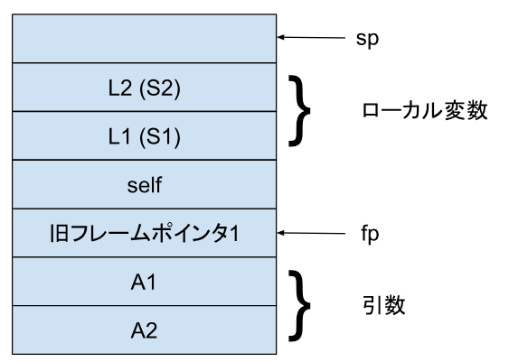

# qstack

## スタック構造

### フレーム

フレームは手続きの呼び出しごとに作成されるスタック上の領域です。
フレームには以下の４つの領域があります。
 
- 評価領域 
  スタックの先頭に位置する領域で、式の評価を行うために使用します。
- ローカル変数領 
  評価領域の次に位置する領域で、ローカル変数を格納します。
- 旧フレームポインタ 
  ひとつ前のフレームポインタを格納する領域です。
  現在のフレームポインタはこの位置を指しています。
- 引数領域 
  手続きに渡された引数を格納する領域です。

各領域には以下のようにワードでアクセスできます。
L1, L2はローカル変数の参照で、S1, S2はローカル変数への格納です。
A1, A2は引数の参照です。
引数はスタックに積んだ順序とは逆の番号でアクセスする点に注意します。
これはフレームポインタ(fp)の相対位置でアクセスするためです。
L1のアドレスはstack[fp + 1]です。
A1のアドレスはstack[fp - 1]です。

実装上は